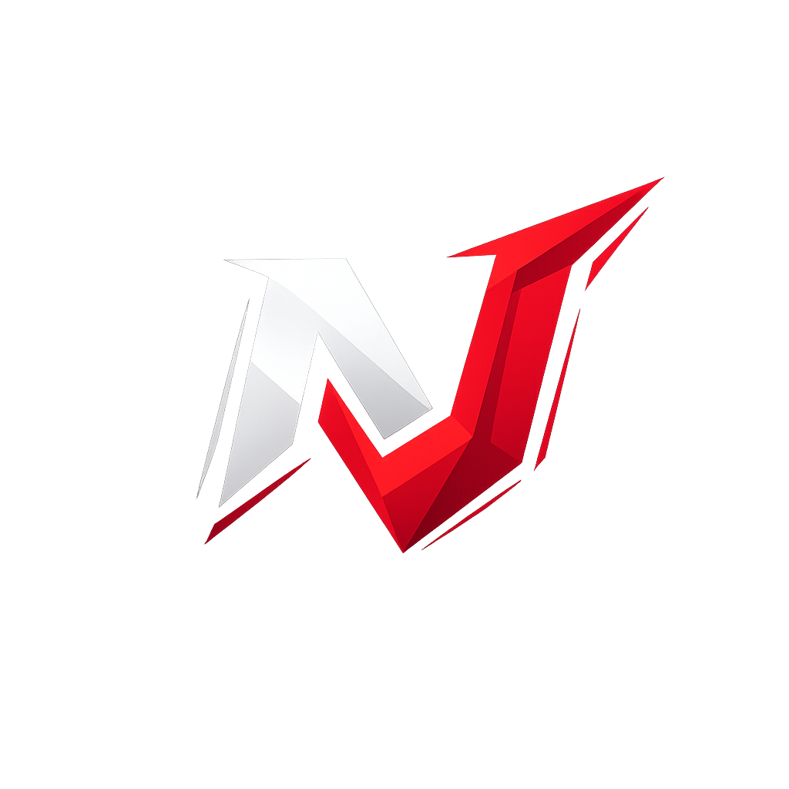
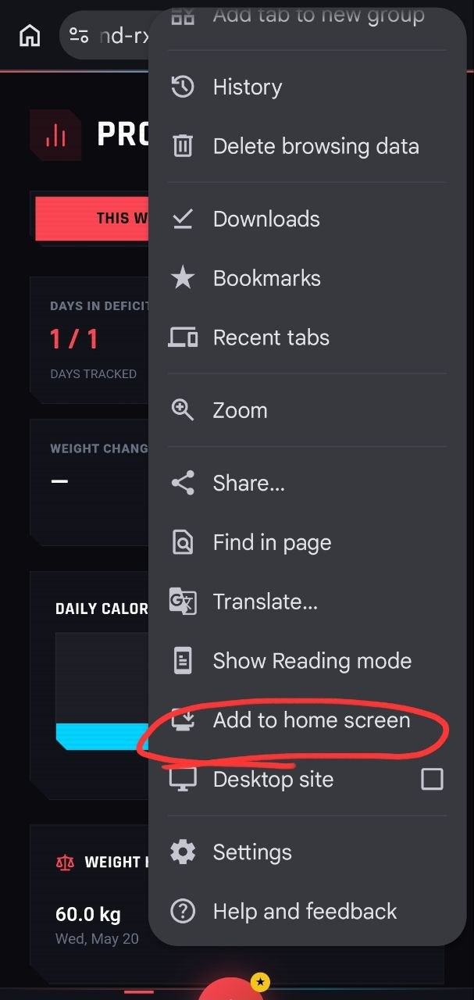

  

  <h1>NUTRITRACK</h1>
  
<strong>A Valorant-inspired, highly competitive fitness and diet tracker built to destroy inconsistency.</strong>

  
🌐 <strong><a href="https://nutritious-frontend-rxs3.vercel.app">Play Now on Vercel</a></strong>

---

## 📖 The Story
This app was built by **Tadiwos**. 

For almost 4 years, I played Valorant on and off, and honestly, I was more dedicated to the game than I was to my studies. Recently, I started working out but hit a massive wall with consistency. I was averaging maybe 10 gym days a month, and sometimes I'd skip an entire month altogether. 

Because I'm a highly competitive guy, I realized the only way to fix my inconsistency was to turn the gym into a ranked ladder. I built **NutriTrack** to make working out as engaging and competitive as grinding RR in Valorant. It's designed for friends to hold each other accountable, track diets, and climb the ranks together.

## 🚀 Getting Started
To use the app to its absolute fullest:
1. **Install the App**: For the best, most immersive experience, we highly insist you install the site as a Chrome app on your device. 
   
   

2. **Sign In**: Create an account and immediately fill out your personal details in the profile section.
3. **Choose Your Agent**: You have 29 Valorant Agents to choose from. Pick what looks cool, or pick your main! *(For the record, my mains are Yoru, Fade, and Viper).*
4. **AI Logging**: You don't *have* to provide your own Groq API key. Non-Groq users automatically fall back to a shared Gemini token. **However**, if the Gemini token gets exhausted, you will need to enter your own personal Groq key in the settings to continue logging seamlessly.

## 🏆 The Ranked System & Scoring
NutriTrack runs on a strict Rank Rating (RR) system, mimicking Valorant's progression:
- **Gain RR**: ONLY workouts get you RR points.
- **Progression**: Every 100 RR promotes you to the next Tier (subrank). Ascending through 3 Tiers promotes you to the next major Rank.
- **Daily Cap**: You can earn a maximum of **+30 RR per day**.
- **Strikes**: Getting a strike will cost you **-50 RR**. 

### 🗑️ The Strike Penalty
Consistency is everything. If you don't log a workout for **more than 2 days** in a given week, you will be struck with a **-50 RR penalty**. 
- If you have plenty of RR, you might just drop a few tiers (e.g., Iron 2 10RR drops to Iron 1 60RR).
- If you are Iron 1 and fall below 0 RR, you will be demoted to the humiliating **PLASTIC** rank with 0 RR. *You do not want that.*

### 🥗 Diet Tracking
Tracking your food, macros, and weight is completely **optional** for climbing the ranks. However, it is highly recommended if you actually want to see physical progress alongside your virtual rank!

## ⚠️ Rules of Engagement
1. **Do not spam the AI.**
2. **Do not DDOS the API.** (I *will* dox you).
3. **Have fun and lift heavy.**

## 📞 Support & Feedback
If you face any bugs, issues, or have a sick idea for a new feature, hit me up on Telegram: **[@Tadi_dev](https://t.me/Tadi_dev)**.
